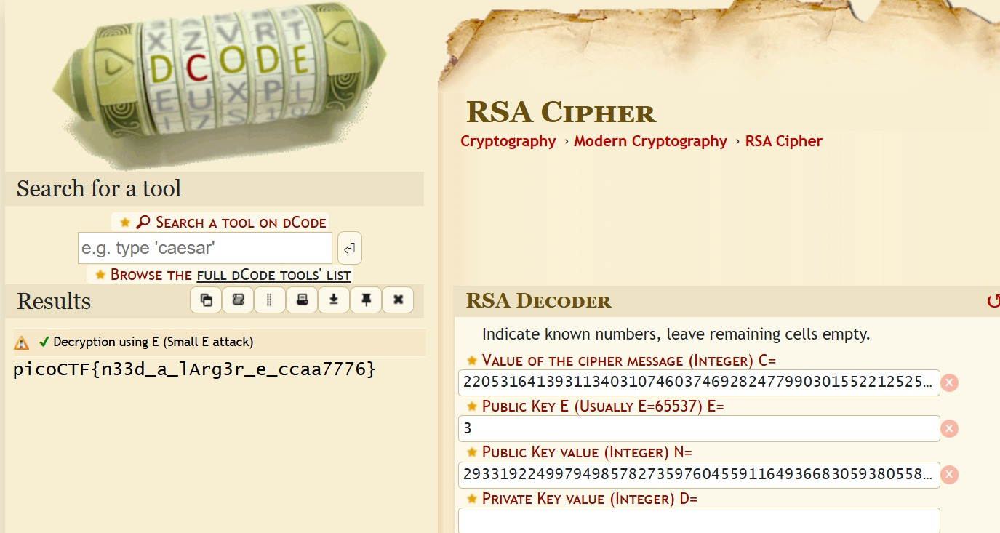
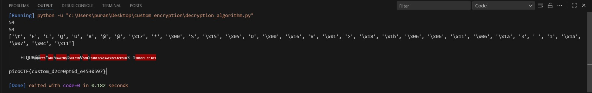

# 1. miniRSA

> Let's decrypt this: [ciphertext](https://jupiter.challenges.picoctf.org/static/d21037ad23ed84cfff20a84768a0f2b2/ciphertext)? Something seems a bit small.

## Solution:

- When I opened up the ciphertext file, I noticed that the values of N and e were given and the encrypted text was also given
- Therefore, I ran this through an online RSA cipher solver to obtain the flag.



## Flag:

```
picoCTF{n33d_a_lArg3r_e_ccaa7776}
```

## Concepts learnt:

- Learnt how to use online tools to decode the RSA cipher

## Notes:

- The value of e ( = 3) is so small that c = m^(e) mod N is useless and the function essentially simplifies to c = m^(e) hence decrypting the text literally just means taking the e-th root of the cipher text

## Resources:

- [dcode - RSA cipher calculator](https://www.dcode.fr/rsa-cipher)

***


# 2. Custom encryption

> Can you get sense of this code file and write the function that will decode the given encrypted file content.
Find the encrypted file here [flag_info](https://artifacts.picoctf.net/c_titan/16/enc_flag) and [code file](https://artifacts.picoctf.net/c_titan/16/custom_encryption.py) might be good to analyze and get the flag.

## Solution:

- I opened up the encryption algorithm to analyze it and also opened up the file containing the encrypted flag
- I noticed that script used two layers of encryption: dynamic_xor_encrypt() and encrypt()
- I also noticed that the script used two static values p and g and the values of a and b were given in the file containing the flag
- Therefore, while making the decryption algorithm, I calculated the values of v and u using the same generator function used in the encryption script
- In the test() function of the encryption there are two variables named semi_cipher and cipher which contained the values obtained from the functions dynamic_xor_encrypt(plain_text, text_key) and encrypt(semi_cipher, shared_key) respectively
- I noticed that the values of key, b_key and shared_key are the same so that made no difference
- At the end of the script, I found the value of the text_key to be "trudeau"

- Now, I tried to reverse the encrypt() function:
    1) First, I noticed that each character from the plaintext was converted to its ASCII integral value and multiplied by the numerical key and also by 311
    2) To reverse this, each value in the cipher array was first divided by (key * 311) and then converted to a character
    3) Finally, I converted the result into a string called "decrypted_str"

- After this, I reversed the dynamic_xor_encrypt() function:
    1) I noticed that the function creates a string called cipher_text and also finds the key length of the text key.
    2) Then, the function loops through the reversed plaintext string
    3) Inside the for loop, the function calculates a variable key_char which essentially reuses the text_key if the plaintext is longer than the text_key
    4) Then, the function then converts a character from plain_text to its ASCII value and does the same to a character from the text_key and then applies the XOR operation to those two values and then converts the value to char and then stores it in a variable called encrypted_char
    5) Then that character is added to the cipher_text string
    6) To reverse this, I copied the function but changed it to:

        ```python
            def dynamic_xor_decrypt(ciphertext, text_key):
        plain_text = ""
        key_length = len(text_key)

        for i, char in enumerate(ciphertext):
            key_char = text_key[i % key_length]
            decrypted_char = chr(ord(char) ^ ord(key_char))
            plain_text += decrypted_char
        return plain_text[::-1]
        ```

    7) After searching it up on google, I figured out that the inverse of XOR is XOR itself
    8) Essentially, I looped through the string cipher_text
    9) After that, I took a character from the cipher text and convert it to its ASCII value and did the same for a character from the key and performed the XOR operation on them and converted the resultant value back to char and concatenated it to the plain_text string
    10) I then returned the reverse of the plaintext string to invert the initial reversing done while encrypting
- After decrypting the two encryptions, I passed the value of text_key as "trudeau" and found the flag

- Below attached is the full python script I wrote to decrypt the cipher text:

```python
a = 97
b = 22
p = 97
g = 31

cipher = [151146, 1158786, 1276344, 1360314, 1427490, 1377108, 1074816, 1074816, 386262, 705348, 0, 1393902, 352674, 83970, 1141992, 0, 369468, 1444284, 16794, 1041228, 403056, 453438, 100764, 100764, 285498, 100764, 436644, 856494, 537408, 822906, 436644, 117558, 201528, 285498]

def generator(g, x, p):
    return pow(g, x) % p

u = generator(g, a, p)
v = generator(g, b, p)

key = generator(v, a, p)
b_key = generator(u, b, p)

print(key)
print(b_key)

def decrypt(ciphertext, key):
    plain = []
    for char in ciphertext:
        plain.append(chr((char // (key * 311))))
    return plain

decrypted = decrypt(cipher, key)
print(decrypted)

decrypted_str = ''.join(decrypted)
print()
print(decrypted_str)

def dynamic_xor_decrypt(ciphertext, text_key):
    plain_text = ""
    key_length = len(text_key)

    for i, char in enumerate(ciphertext):
        key_char = text_key[i % key_length]
        decrypted_char = chr(ord(char) ^ ord(key_char))
        plain_text += decrypted_char
    return plain_text[::-1]


semi_cipher = decrypt(cipher, key)
final_plaintext = dynamic_xor_decrypt(semi_cipher, "trudeau")
print()
print(final_plaintext)
```

- Below attached is the output obtained from the decryption script



## Flag:

```
picoCTF{custom_d2cr0pt6d_e4530597}
```

## Concepts learnt:

- Learnt how to figure out how an encryption algoritm works when the encryption script is given
- Learnt how to reverse engineer an encryption algorithm and write a script to decrypt it

## Notes:

- Nil

## Resources:

- [stackoverflow - Convert a list of characters into a string](https://stackoverflow.com/questions/4481724/convert-a-list-of-characters-into-a-string)
- [stackoverflow - What is the inverse function to XOR](https://stackoverflow.com/questions/14279866/what-is-the-inverse-function-to-xor)
- [geeksforgeeks - Enumerate() in Python](https://www.geeksforgeeks.org/python/enumerate-in-python/)
- [sololearn - Python String question: What does [::-1] mean?](https://www.sololearn.com/en/Discuss/1838639/python-string-question-what-does-1-mean)

***


# 3. rsa_oracle

> Can you abuse the oracle?
An attacker was able to intercept communications between a bank and a fintech company. They managed to get the message (ciphertext) and the password that was used to encrypt the message.
After some intensive reconassainance they found out that the bank has an oracle that was used to encrypt the password and can be found here nc titan.picoctf.net 53208. Decrypt the password and use it to decrypt the message. The oracle can decrypt anything except the password.

## Solution:

- Since, this was a problem on RSA without being given the values of N and e. I figured that we had to make use of one of the known weaknesses of RSA encryption.
- Therefore, I wrote a python script using pwntools to do so.
- The script remotes into the picoctf connection and waits till the first messages incoming from the remote connection to end, i.e., the script waits until the word 'decrypt' is received.
- Then, the script sends a payload: "E\n" to the server to indicate that encrypted is wanted to be done
- It sends that payload and stores the received response into a variable called response
- Then, the python scripts send the value of 2 as ASCII to obtain the encrypted value of 2
- This gives us the value of 2^e and we multiply that with m^e which is basically the password
- Then, the script moves onto the decryption part
- The python scripts sends D for decryption and and then sends the value of "(2m)^e" to the server
- The server decrypts it which gives us 2m
- The script then divides the response by 2 to obtain m
- Finally, it converts the values to hex, removes the 0x and then it converts them to ASCII and closes the connection
- Below attached is the python script:

```python
from pwn import *

connection = remote('titan.picoctf.net', 57529)

# Get the first messages and send E to the program to choose Encryption
response = connection.recvuntil('decrypt.')
print(response.decode())
payload = b'E' + b'\n'

connection.send(payload)

response = connection.recvuntil('keysize):')
print(response.decode())

# We want to encrypt the number 2 so we send the ASCII value of 2.
payload = b'\x02' + b'\n'
connection.send(payload)
response = connection.recvuntil('ciphertext (m ^ e mod n)')
response = connection.recvline()

# We now have 2^e, we want to multiply by m^e which is the password
num=int(response.decode()) * 1634668422544022562287275254811184478161245548888973650857381112077711852144181630709254123963471597994127621183174673720047559236204808750789430675058597

# Decrypting process
response = connection.recvuntil('decrypt.')
print(response.decode())
payload = b'D' + b'\n'
connection.send(payload)

#We decrypt 2^e*m^e or (2m)^e, which gives us 2m
response = connection.recvuntil('decrypt:')
print(response.decode())
connection.send(str(num)+'\n')

response = connection.recvuntil('hex (c ^ d mod n):')
print(response.decode())
response = connection.recvline()
print(response.decode())

# Now that we have the response, convert it from hexadecimal and then divide it by
num=int(response,16)//2
print(hex(num))

# Now we convert this to ASCII
hex_string=hex(num)[2:] # get rid of 0x
byte_array=bytes.fromhex(hex_string)
print(byte_array.decode('ascii'))

connection.close()
```

- This gave me: 4955e
- Then, I had to use the openssl command: "openssl enc -aes-256-cbc -d -in secret.enc -k 4955e"
- This command line basically means that: use the openssl tool and the enc flag specifies that the user wants to use its symmetric encryption/decryption functions
- The following flags: "-aes-256-cbc" tell the cipher algorithm to use the advanced encryption standard with a key size of 256 bits in cipher block chaining mode
- The -d flag tells the algorithm to decrypt the contents
- The argument "-in secret.enc" tells the algorithm to read the encrypted contents from secret.enc
- The argument "-k 4955e" tells the algorithm to use "4955e" as the key
- Below attached is the terminal output from this command being ran:

```bash
neelaypuranik@Neelays-Laptop:~$ openssl enc -aes-256-cbc -d -in secret.enc -k 4955e
*** WARNING : deprecated key derivation used.
Using -iter or -pbkdf2 would be better.
picoCTF{su((3ss_(r@ck1ng_r3@_4955eb5d}neelaypuranik@Neelays-Laptop:~$
```

## Flag:

```
picoCTF{su((3ss_(r@ck1ng_r3@_4955eb5d}
```

## Concepts learnt:

- Learnt how to exploit the weakness of the RSA cipher
- Learnt how to write python scripts using pwntools to do desired tasks
- Learnt how to use the openssl program

## Notes:

- Nil

## Resources:

- [RSA Encryption Algorithm Basics](https://youtu.be/hm8s6FAc4pg?si=EqiamOScxJK7jUEA)
- [More basics on RSA](https://youtu.be/wcbH4t5SJpg?si=51G7J_WJNo7-09sV)
- [Modular Exponentiation](https://youtu.be/xcr-eyOgnTA?si=jhUJdUOIN5pWkqrB)

***
