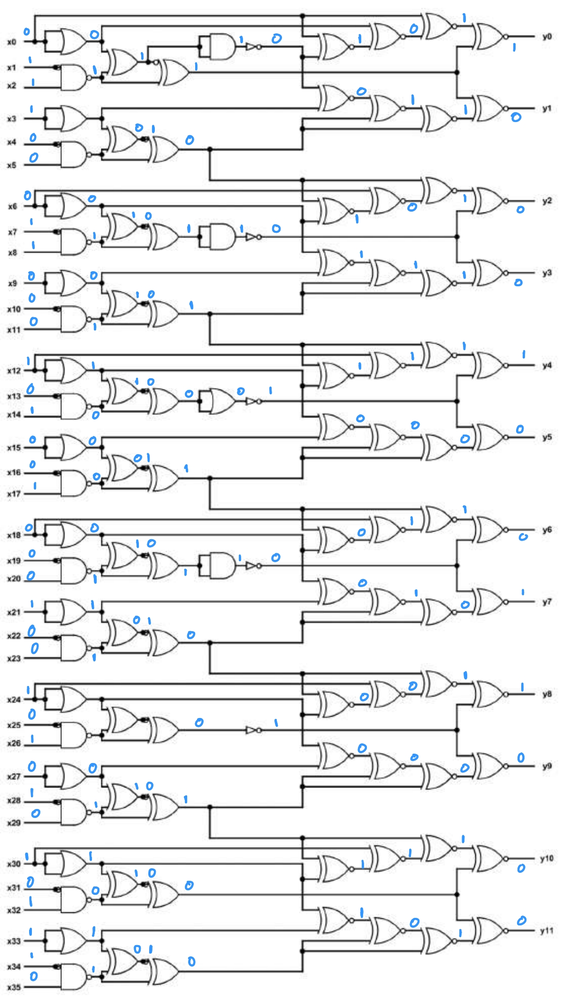

# 1. IQ Test

> let your input x = 30478191278.

wrap your answer with nite{ } for the flag.

As an example, entering x = 34359738368 gives (y0, ..., y11), so the flag would be nite{010000000011}.


## Solution:

- Initially, I tried playing around with the meta data of the PNG file but it appeared to be normal only.
- I then looked at the logic circuit closely and observed that it took a 36 bit binary digit as input and produced a 12 bit binary output.
- I converted the value of x from denary to binary giving: 011100011000101001000100101010101110
- Then, I manually solved the logic circuit:



## Flag:

```
nite{100010011000}
```

## Concepts learnt:

- Breaking down and solving logic circuits

## Notes:

- Sometimes, the simplest way forward is the way to go

## Resources:

- Nil

***


# 2. i_like_logic

> i like logic and i like files, apparently, they have something in common, what should my next step be.

## Solution:

- I was not aware of the SAL file format so first of all I researched a bit on that
- It was apparently a logic capture file for some software called Saleae logic 2
- I opened the file in that software and found out that only the D3 channel was active.
- I then read up on some information on filters and figured out that this points to the use of the Async Serial Analyzer filter to be used
- Therefore, I set the channel to D3 in the Async Serial analyzer and ran it, Initially it showed me some hex values but upon changing the format to ASCII and digging a little, I found the flag


## Flag:

```
FCSC{b1dee4eeadf6c4e60aeb142b0b486344e64b12b40d1046de95c89ba5e23a9925}
```

## Concepts learnt:

- Learnt how to analyze previously unknown file types

## Notes:

- Nil

## Resources:

- [SALEAE Logic 2 Tutorial - Protocol Analyzers](https://www.youtube.com/watch?v=Ak9R4yxQPhs)
- [TOTALPHASE - Understanding I2C and SPI Communication Protocols](https://www.totalphase.com/blog/2021/12/i2c-vs-spi-vs-uart-introduction-and-comparison-similarities-differences/?srsltid=AfmBOorDPu4PACMYCJ-qgBSezVzkEISjbAtdJWbqEexsgKWSsFEGIMw8)
- [saleae - Async Serial Analyzer - User Guide](https://support.saleae.com/product/user-guide/protocol-analyzers/analyzer-user-guides/using-async-serial)

***


