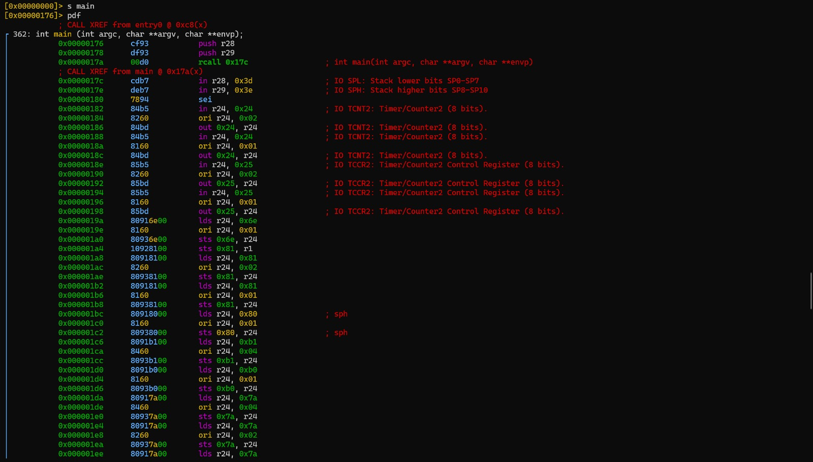
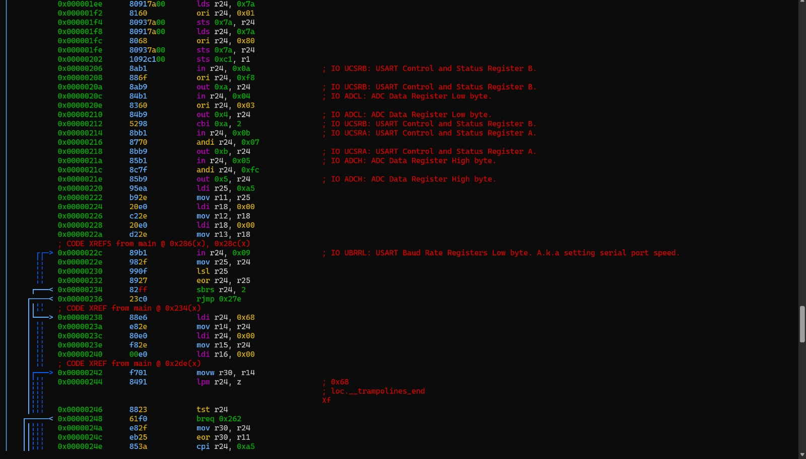
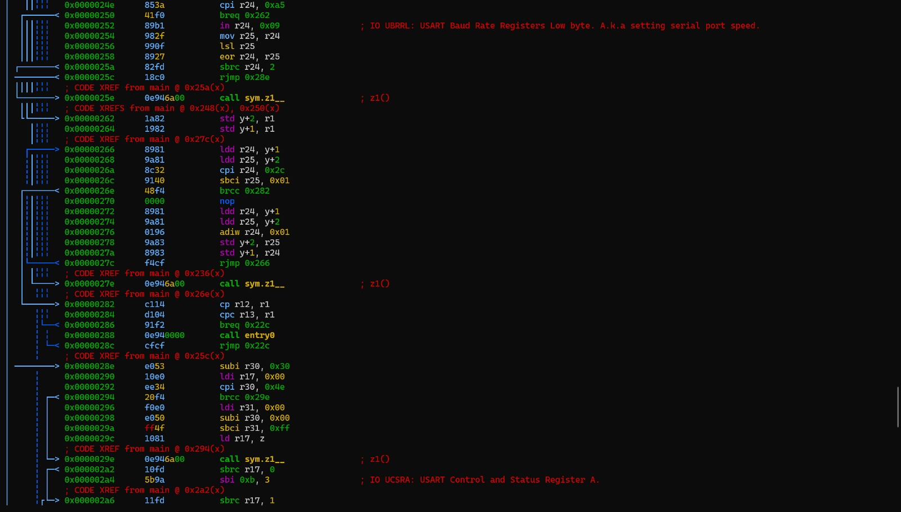
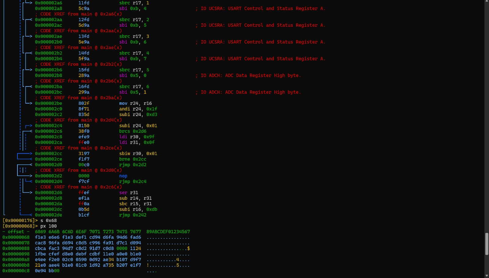
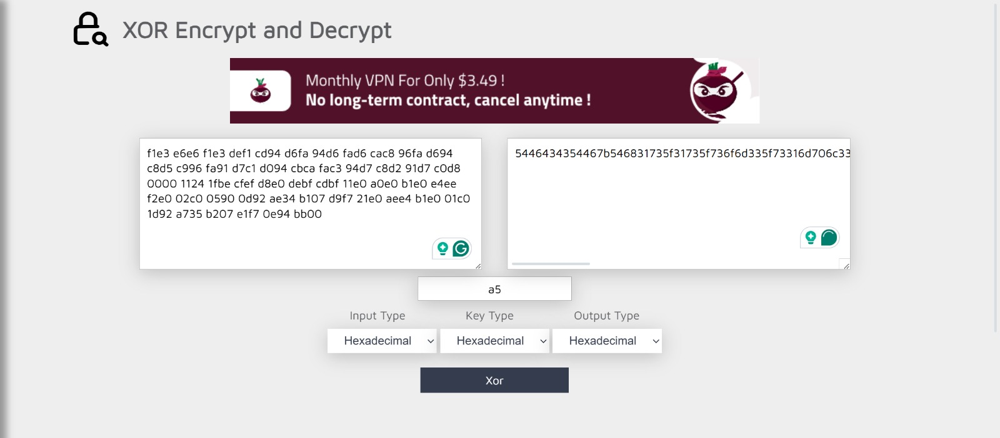

# 1. IQ Test

> let your input x = 30478191278.

wrap your answer with nite{ } for the flag.

As an example, entering x = 34359738368 gives (y0, ..., y11), so the flag would be nite{010000000011}.


## Solution:

- Initially, I tried playing around with the meta data of the PNG file but it appeared to be normal only.
- I then looked at the logic circuit closely and observed that it took a 36 bit binary digit as input and produced a 12 bit binary output.
- I converted the value of x from denary to binary giving: 011100011000101001000100101010101110
- Then, I manually solved the logic circuit:


## Flag:

```
nite{100010011000}
```

## Concepts learnt:

- Breaking down and solving logic circuits

## Notes:

- Sometimes, the simplest way forward is the way to go

## Resources:

- Nil

***


# 2. i_like_logic

> i like logic and i like files, apparently, they have something in common, what should my next step be.

## Solution:

- I was not aware of the SAL file format so first of all I researched a bit on that
- It was apparently a logic capture file for some software called Saleae logic 2
- I opened the file in that software and found out that only the D3 channel was active.
- I then read up on some information on filters and figured out that this points to the use of the Async Serial Analyzer filter to be used
- Therefore, I set the channel to D3 in the Async Serial analyzer and ran it, Initially it showed me some hex values but upon changing the format to ASCII and digging a little, I found the flag


## Flag:

```
FCSC{b1dee4eeadf6c4e60aeb142b0b486344e64b12b40d1046de95c89ba5e23a9925}
```

## Concepts learnt:

- Learnt how to analyze previously unknown file types

## Notes:

- Nil

## Resources:

- [SALEAE Logic 2 Tutorial - Protocol Analyzers](https://www.youtube.com/watch?v=Ak9R4yxQPhs)
- [TOTALPHASE - Understanding I2C and SPI Communication Protocols](https://www.totalphase.com/blog/2021/12/i2c-vs-spi-vs-uart-introduction-and-comparison-similarities-differences/?srsltid=AfmBOorDPu4PACMYCJ-qgBSezVzkEISjbAtdJWbqEexsgKWSsFEGIMw8)
- [saleae - Async Serial Analyzer - User Guide](https://support.saleae.com/product/user-guide/protocol-analyzers/analyzer-user-guides/using-async-serial)

***


# 3. bare-metal-alchemist

> my friend recommended me this anime but i think i've heard a wrong name.

## Solution:

- I first used the command: "file firmware.elf" to figure out what type of file firmware.elf was.
- It turned out to be an ELF executable file of the AVR 8-bit format
- This is not an usual ELF executable like ARM/x86 but is the bare firmware used in embedded systems
- I researched on which software is best fit to decompile such types of binaries and found out that radare is a really good software to utilize
- I first opened the ELF in radare and navigated to the main function using "s main"
- Then, I used the command "pdf" to print the full disassembly of the function
- Upon going through the disassembled code, I figure out that the code is essentially performing an EOR operation (exlusive OR) on the data stored in the program memory and the constant stored in a register.
- Tracing the register assignments up the chain revealed the constant to be "0xA5"
- I concluded that the data in 0x68 is ciphertext since its bytes look random and non-printable
- Therefore, I used the command "s 0x68" to move the pointer to that memory address
- Then, I used the command px 100 to print the first 100 bytes stored in that and its following memory locations
- Now, I knew the encrypted content and the key
- Therefore, I used an online XOR decryptor to obtain the decrypted contents in hexadecimal
- Finally, I used a hexadecimal to ASCII convertor to obtain the flag in a readable file format







## Flag:

```
TFCCTF{Th1s_1s_som3_s1mpl3_4rdu1no_f1rmw4re}
```

## Concepts learnt:

- Learnt how to disassemble binaries
- Learnt how to analyze the movement of data through registers

## Notes:

- Nil

## Resources:

- [Radare2 Tutorial 8 - Solving a CTF challenge](https://www.youtube.com/watch?v=BcjvRf6IAFA&list=PLg_QXA4bGHpvsW-qeoi3_yhiZg8zBzNwQ)
- [geeksforgeeks - How to Use Radare2](https://www.geeksforgeeks.org/ethical-hacking/how-to-use-radare2/)
- [XOR Encrypt and Decrypt](https://md5decrypt.net/en/Xor/)
- [RapidTables - Hex to String Converter](https://www.rapidtables.com/convert/number/hex-to-ascii.html)


***

