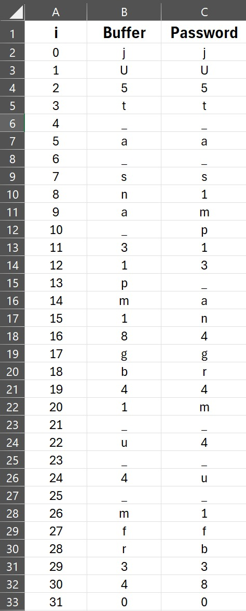

# 1. GDB baby step 1

> Can you figure out what is in the eax register at the end of the main function? Put your answer in the picoCTF flag format: picoCTF{n} where n is the contents of the eax register in the decimal number base. If the answer was 0x11 your flag would be picoCTF{17}.
Disassemble this.

## Solution:

- I downloaded the file which was to be analyzed
- I then used the command "file <file path>" to figure out what type of file it was
- After figuring out that it was an ELF executable file, I used an online binary decompiler to decompile the machine code into something readable
- Upon analyzing the main function, I found the value of the flax in hexadecimal
- I, then, converted the value to denary and got the flag.

```bash
neelaypuranik@Neelays-Laptop:~/Projects/neelay_phase2$ file /mnt/c/Users/puran/Downloads/debugger0_a
/mnt/c/Users/puran/Downloads/debugger0_a: ELF 64-bit LSB pie executable, x86-64, version 1 (SYSV), dynamically linked, interpreter /lib64/ld-linux-x86-64.so.2, BuildID[sha1]=15a10290db2cd2ec0c123cf80b88ed7d7f5cf9ff, for GNU/Linux 3.2.0, not stripped
neelaypuranik@Neelays-Laptop:~/Projects/neelay_phase2$
```

The content obtained upon decompiling the file:

```c
#include "out.h"


int _init(EVP_PKEY_CTX *ctx)

{
  int iVar1;

  iVar1 = __gmon_start__();
  return iVar1;
}


void FUN_00101020(void)

{
  (*(code *)(undefined *)0x0)();
  return;
}


void FUN_00101030(void)

{
  __cxa_finalize();
  return;
}


void processEntry _start(undefined8 param_1,undefined8 param_2)

{
  undefined1 auStack_8 [8];

  __libc_start_main(main,param_2,&stack0x00000008,__libc_csu_init,__libc_csu_fini,param_1,auStack_8)
  ;
  do {
                    // WARNING: Do nothing block with infinite loop
  } while( true );
}


// WARNING: Removing unreachable block (ram,0x00101083)
// WARNING: Removing unreachable block (ram,0x0010108f)

void deregister_tm_clones(void)

{
  return;
}


// WARNING: Removing unreachable block (ram,0x001010c4)
// WARNING: Removing unreachable block (ram,0x001010d0)

void register_tm_clones(void)

{
  return;
}


void __do_global_dtors_aux(void)

{
  if (completed_8061 != '\0') {
    return;
  }
  FUN_00101030(__dso_handle);
  deregister_tm_clones();
  completed_8061 = 1;
  return;
}


void frame_dummy(void)

{
  register_tm_clones();
  return;
}


undefined8 main(void)

{
  return 0x86342;
}


void __libc_csu_init(EVP_PKEY_CTX *param_1,undefined8 param_2,undefined8 param_3)

{
  long lVar1;

  _init(param_1);
  lVar1 = 0;
  do {
    (*(code *)(&__frame_dummy_init_array_entry)[lVar1])((ulong)param_1 & 0xffffffff,param_2,param_3)
    ;
    lVar1 = lVar1 + 1;
  } while (lVar1 != 1);
  return;
}


void __libc_csu_fini(void)

{
  return;
}


void _fini(void)

{
  return;
}
```

## Flag:

```
picoCTF{549698}
```

## Concepts learnt:

- Learnt how to figure out what type of file a given file is by using the "file <file path>" command in linux
- Learnt how to analyze decompiled machine code

## Notes:

- Nil

## Resources:

- [Decompiler Explorer](https://dogbolt.org/?id=d96ad254-edc3-4a13-ac38-ab4ade6aa23b#Ghidra=134)
- [RapidTables - Hex to Denary converter](https://www.rapidtables.com/convert/number/hex-to-decimal.html?x=86342)

***


# 2. ARMssembly 1

> For what argument does this program print `win` with variables 58, 2 and 3? File: chall_1.S Flag format: picoCTF{XXXXXXXX} -> (hex, lowercase, no 0x, and 32 bits. ex. 5614267 would be picoCTF{0055aabb})

## Solution:

- Initially, I opened the file in VS code to analyze its contents
- I figured out that the code is written in assembly language
- After that, I used an online assembly-to-c converter to convert the assembly code to c
- I, then, analyzed the code. It went as following:
  1) First, a temp variable is initialized with the value "a << b", i.e., it left shifts the value of a by two bits. This essentially means that the value of a is being multiplied by 4. Therefore, temp stores the value 232 (58 * 4).

  2) The next line is "temp = temp / c". This line computes the quotient of the division 232/3. Therefore, temp becomes 77.

  3) The next line is "temp = temp - input". This line subtracts the function parameter: input from the temp variable and assigns the new value to temp.

  4) The function then returns this value of temp

- I skipped a few irrelevant lines

  5) One of the important lines is "int result = func (val)". The value of val is the integer obtained from the first command line string.

  6) Then the line "if (result == 0) { puts("You win!"); } else { puts("You Lose :("); }" prints the flag if the value of result is 0.

  7) Therefore, the value of val has to be 77 as result == 77 - val.

- I then converted 77 to hexadecimal and put it into the format needed.

The decompiled code is:

```c
#include <stdio.h>
#include <stdlib.h>

int func(int input) {
    int a = 58;
    int b = 2;
    int c = 3;

    int temp = a << b;
    temp = temp / c;
    temp = temp - input;

    return temp;
}

int main(int argc, char *argv[]) {
    int val = atoi(argv[1]);
    int result = func(val);

    if (result == 0) {
        puts("You win!");
    } else {
        puts("You Lose :(");
    }

    return 0;
}
```

## Flag:

```
picoCTF{0000004D}
```

## Concepts learnt:

- I learnt that assembly code can be decompiled to C code and then be analyzed to find what is desired (the flag in this case)

## Notes:

- I tried to compile and run the assembly code but it resulted in errors so I looked for a different approach

## Resources:

- [CodeConvert - Assembly to C](https://www.codeconvert.ai/assembly-to-c-converter)
- [RapidTables - Denary to Hex converter](https://www.rapidtables.com/convert/number/decimal-to-hex.html)

***


# 3. vault-door-3

> This vault uses for-loops and byte arrays. The source code for this vault is here: VaultDoor3.java

## Solution:

- I opened the java file to analyze its contents
- I figured out that the program takes a string input from the user and strips it of "picoCTF".
- Then, the program passes the inputted value to a function called "checkPassword"
- This function first checks if the string is of 32 characters and rejects it if it is not
- Then, It runs some for loops to change the arrangemnt of the characters in the password string and stores the rearranged string in a character array called "buffer"
- I reverse engineered this encoding to obtain the flag
- I did that by making a table on excel (did this because of the hint given) and tracking the values of i, buffer[i], and the character in password at index i

```java
import java.util.*;

class VaultDoor3 {
    public static void main(String args[]) {
        VaultDoor3 vaultDoor = new VaultDoor3();
        Scanner scanner = new Scanner(System.in);
        System.out.print("Enter vault password: ");
        String userInput = scanner.next();
	String input = userInput.substring("picoCTF{".length(),userInput.length()-1);
	if (vaultDoor.checkPassword(input)) {
	    System.out.println("Access granted.");
	} else {
	    System.out.println("Access denied!");
        }
    }

    // Our security monitoring team has noticed some intrusions on some of the
    // less secure doors. Dr. Evil has asked me specifically to build a stronger
    // vault door to protect his Doomsday plans. I just *know* this door will
    // keep all of those nosy agents out of our business. Mwa ha!
    //
    // -Minion #2671
    public boolean checkPassword(String password) {
        if (password.length() != 32) {
            return false;
        }
        char[] buffer = new char[32];
        int i;
        for (i=0; i<8; i++) {
            buffer[i] = password.charAt(i);
        }
        for (; i<16; i++) {
            buffer[i] = password.charAt(23-i);
        }
        for (; i<32; i+=2) {
            buffer[i] = password.charAt(46-i);
        }
        for (i=31; i>=17; i-=2) {
            buffer[i] = password.charAt(i);
        }
        String s = new String(buffer);
        return s.equals("jU5t_a_sna_3lpm18gb41_u_4_mfr340");
    }
}
```

Below is the excel table I made:



## Flag:

```
picoCTF{jU5t_a_s1mp13_an4gr4m_4_u_1fb380}

```

## Concepts learnt:

- Learnt how to use reverse engineering to decode an encoded string
## Notes:

- Nil

## Resources:

- Nil

***
