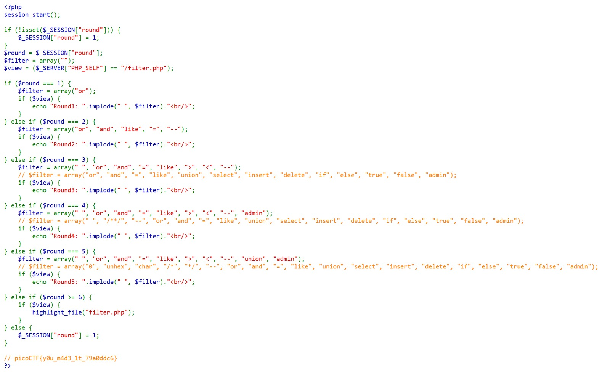
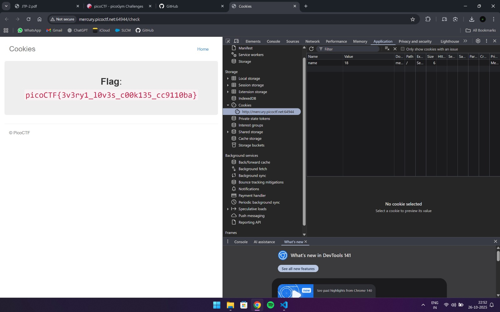
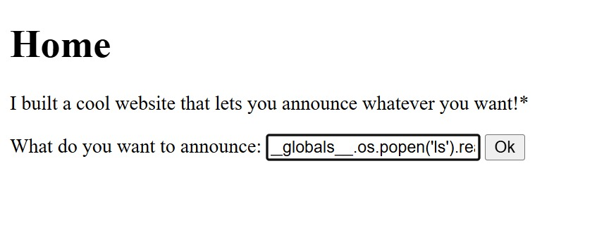
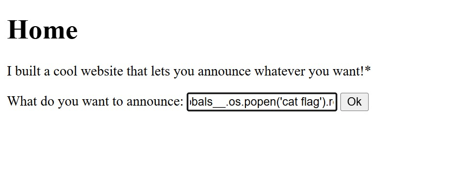
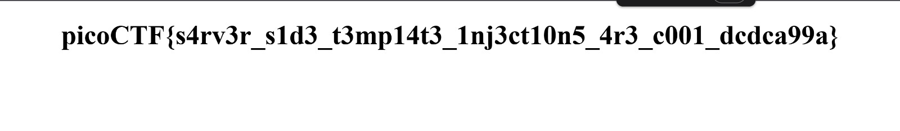

# 1. Web Gauntlet

> Can you beat the filters?
Additional details will be available after launching your challenge instance.

## Solution:

- I started up the challenge instance and navigated to the two sites
- From the login screen I figured out that this challenge was about SQL Injection
- I browsed the internet for a SQL cheat-sheet and found a useful one on github
- From the challenge description and the file name: "filter.php", I figured out that the filter.php file contains the commands I cannot use in my SQL Injections
- I then used the cheat-sheet to find bypass authentication commands which also satisfied the conditions listed in the filter.php file.
- After doing so five times, I got the flag (It appeared along with the source code on reloading the filter.php file after I had solved all levels)



## Flag:

```
picoCTF{y0u_m4d3_1t_79a0ddc6}
```

## Concepts learnt:

- Learnt about the very basics of SQL Injections
- Learnt about the purpose SQL Injections serve

## Notes:

- I initially tried only using the commands given in the filter.php file but later realised that I have to not use them

## Resources:

- [github.com - payloadbox](https://github.com/payloadbox/sql-injection-payload-list)

***


# 2. Cookies

> Who doesn't love cookies? Try to figure out the best one. http://mercury.picoctf.net:64944/

## Solution:

- I inspected the website by pressing F12
- Then, I navigated to the Application tab and into the cookies section in the list
- I noticed that this challenge is similar to the one I solved in the CitadelCTF where we had to edit the values of cookies to obtain the flag
- I tried changing the value of the cookie named "name" from -1 to 0 and this lead me to a different screen
- I then changed the value from 0 to 1 and it again changed the name of the cookie from "snickerdoodle" to "chocolate chip"
- I then incremented the value again and noticed that the cookie name keeps changing every time
- Therefore, I kept incrementing the value until I reached the flag. (The value turned out to be 18)



## Flag:

```
picoCTF{3v3ry1_l0v3s_c00k135_cc9110ba}
```

## Concepts learnt:

- Learnt how to manipulate website cookies to get the desirable output

## Notes:

- Nil

## Resources:

- Nil

***


# 3. SSTI1

> I made a cool website where you can announce whatever you want! Try it out!
I heard templating is a cool and modular way to build web apps! Check out my website here!

## Solution:

- The hint for the challenge said server side template injection.
- Sometimes, an application might treat user input as template code instead of plain text. This lets an attacker inject template expressions (like {{...}}) which the server can run. This allows the attacker to access sensitive data stored in the server and even execute malicious commands from there.
- To test this out, I tried running "{{7*7}}" as told to do so on a site I found
- I, then, found a command which will allow me to run linux commands on the server using: {{self._TemplateReference__context.cycler.__init__.__globals__.os.popen('<linux_command>').read() }}
- Therefore, I ran "{{self._TemplateReference__context.cycler.__init__.__globals__.os.popen('ls').read() }}" to obtain the content stored on the server
- I found a file there named flag.
- Then, I ran "{{self._TemplateReference__context.cycler.__init__.__globals__.os.popen('cat flag').read() }}" to cat the contents of the file named flag and obtained the flag.
- Below attached are the relevant images:








## Flag:

```
picoCTF{s4rv3r_s1d3_t3mp14t3_1nj3ct10n5_4r3_c001_dcdca99a}
```

## Concepts learnt:

- Learnt what is SSTI
- Learnt how to use basic SST injections

## Notes:

- Nil

## Resources:

- [Abnormal - A Guide to Understanding Server-Side Template Injection](https://abnormal.ai/blog/server-side-template-injection)

***
